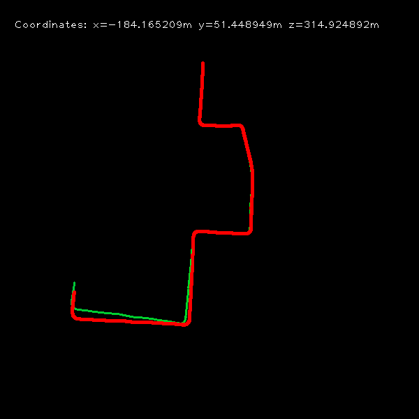

**Keywords:** FAST Feature Detection, LK Feature Tracking, Five-Point Motion Estimation

port from https://github.com/yueying/LearningVO

### Results
Lucas Kanade


SIFT
![sift][sift.png]

ROMA
![roma][roma.png]


### Dependencies
```py
python3 -m venv .venv
source .venv/bin/activate
poetry install
```
 
### Usage
Modify the path in test.py to your image sequences and ground truth trajectories, then run
```
python test.py --method roma --path ~/datasets/KITTI/dataset_sample
```